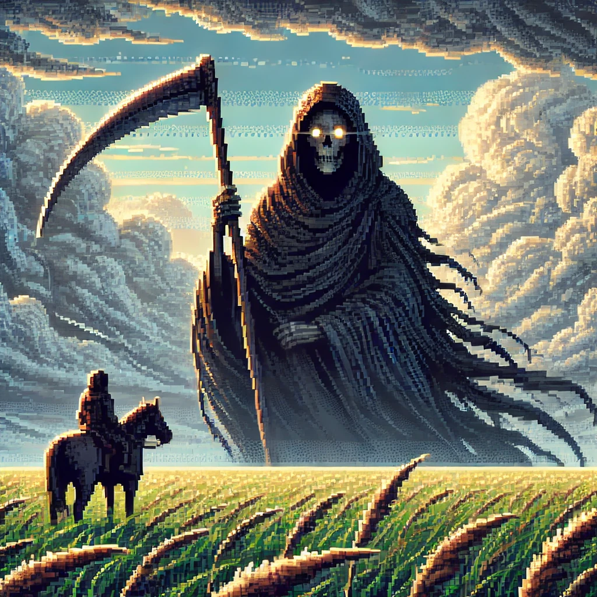

<!---
Caso o jogo tenha uma logo, disponibilizá-la no README
--->

## 📃 Sobre o jogo
<!---
Aqui faça uma descrição breve para os jogadores sobre o seu jogo! Qual o gênero? É multijogador? etc...
--->

### História

Após perder sua amada, o protagonista descobre uma forma de trazê-la de volta coletando fragmentos de alma. Para isso, ele explora um mundo sombrio e místico, enfrentando e libertando criaturas que guardam esses fragmentos. Cada vitória o aproxima de seu objetivo.

### Gameplay

O jogo é top-down, com mecânicas de combate e esquiva por "dash". O jogador enfrenta inimigos e ganha novas habilidades ao libertá-los, tornando-se mais forte para superar os próximos desafios.

## 🎮 Engine & linguagens
<!---
Aqui recomenda-se que sejam colocados os ícones da game engine e das linguagens de programação que foram utilizadas no desenvolvimento do seu jogo, como o exemplo à seguir
--->

## 🧠 Desenvolvedores
<!---
Aqui sugere-se que sejam colocados ao menos os nomes de cada desenvolvedor envolvido na criação do seu jogo
--->

- [Diego Carlito](https://github.com/DiegoCarlito)
- [Marcos Castilhos](https://github.com/Marcosatc147)
